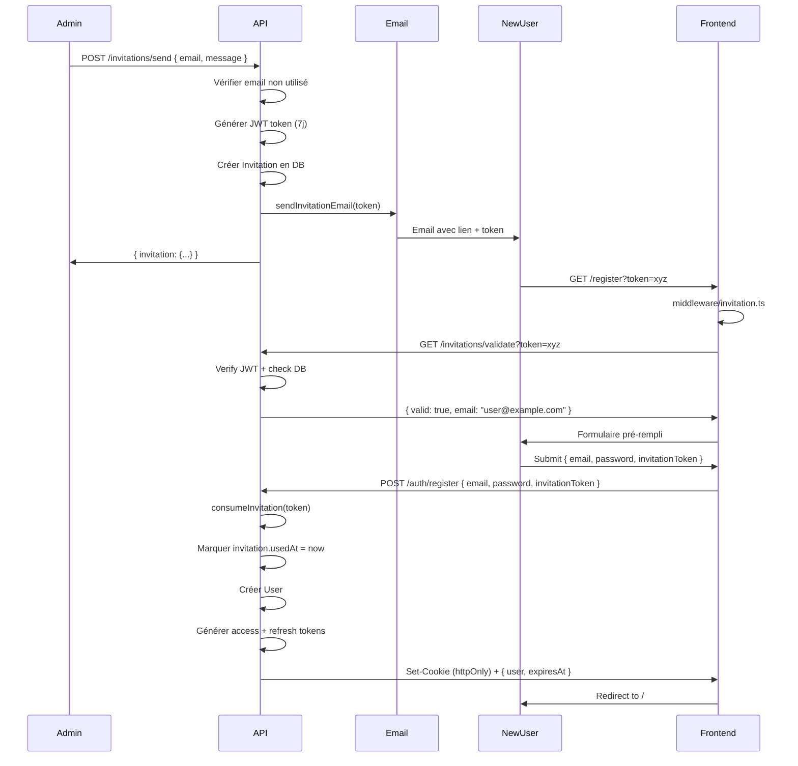

# Plan Clean Slate - Refactoring Authentication

> **Approche** : Supprimer l'ancien système et recréer from scratch selon le design idéal  
> **Principe** : Pas de compromis, implémentation pure sans dette technique

---

## 📋 Table des matières

1. [Vue d'ensemble](#vue-densemble)
2. [Système de permissions (API) - À CONSERVER](#système-de-permissions-api---à-conserver)
3. [Système d'invitations - À CONSERVER](#système-dinvitations---à-conserver)
4. [Fichiers à SUPPRIMER](#fichiers-à-supprimer)
5. [Fichiers à CRÉER](#fichiers-à-créer)
6. [Fichiers à ADAPTER (design uniquement)](#fichiers-à-adapter-design-uniquement)
7. [Séquences d'implémentation](#séquences-dimplémentation)
8. [Migration utilisateurs](#migration-utilisateurs)

---

## Vue d'ensemble

### ✅ Ce qui reste INCHANGÉ

**API - Système de permissions complet** :

- ✅ `PermissionsGuard` - Guard pour vérifier les permissions
- ✅ `@Permissions()` decorator - Permissions OR logic
- ✅ `@PermissionsAllOf()` decorator - Permissions AND logic
- ✅ `Permission` enum - 100+ permissions définies
- ✅ `ROLE_PERMISSIONS` config - Mapping role → permissions
- ✅ `AuthorizationService` - Vérification des permissions

**API - Système d'invitations complet** :

- ✅ `InvitationsModule` - Module complet
- ✅ `InvitationsService` - Logique métier (sendInvitation, validateToken, consumeInvitation)
- ✅ `InvitationsController` - Endpoints (send, validate, list, cancel)
- ✅ `Invitation` entity - Table invitations
- ✅ Email service - Envoi emails d'invitation

**Frontend - Composables existants** :

- ✅ `useInvitationApi()` - Déjà bien fait avec TanStack Query
- ✅ `useInvitationValidation()` - Helper pour page register

### 🔄 Ce qui CHANGE (auth uniquement)

**Mécanique d'authentification** :

- ❌ localStorage → ✅ Cookies httpOnly
- ❌ Authorization header → ✅ Cookies automatiques
- ❌ Double stockage → ✅ Single source of truth (cookies)
- ❌ Client-side token management → ✅ Server-side (API gère cookies)
- ❌ Complex auth store → ✅ Minimal state (user + helpers)
- ❌ Multiple plugins/middleware → ✅ Single server middleware SSR

---

## Système de permissions (API) - À CONSERVER

### Architecture actuelle (PARFAIT, ne pas toucher)

```
src/auth/
├── guards/
│   └── permissions.guard.ts          ✅ CONSERVER tel quel
├── decorators/
│   ├── permissions.decorator.ts      ✅ CONSERVER
│   └── permissions-all-of.decorator.ts ✅ CONSERVER
├── enums/
│   ├── permission.enum.ts            ✅ CONSERVER
│   └── role.enum.ts                  ✅ CONSERVER
└── services/
    └── authorization.service.ts      ✅ CONSERVER

src/config/
└── permissions.config.ts             ✅ CONSERVER
```

### Comment ça marche (référence)

**1. Définition des permissions** (`permission.enum.ts`) :

```typescript
export enum Permission {
  CREATE_USER = 'CREATE_USER',
  READ_ALL_USERS = 'READ_ALL_USERS',
  UPDATE_ANY_USER = 'UPDATE_ANY_USER',
  CREATE_MIXTAPE = 'CREATE_MIXTAPE',
  // ... 100+ permissions
}
```

**2. Mapping rôles → permissions** (`permissions.config.ts`) :

```typescript
export const ROLE_PERMISSIONS: Record<Role, Permission[]> = {
  [Role.ADMIN]: [
    /* toutes les permissions */
  ],
  [Role.MANAGER]: [
    /* permissions gestion sauf users */
  ],
  [Role.CONTRIBUTOR]: [
    /* own resources + read all */
  ],
  [Role.VIEWER]: [
    /* read-only */
  ],
}
```

**3. Usage dans les controllers** :

```typescript
@Permissions(Permission.CREATE_MIXTAPE)
@UseGuards(AuthGuard, PermissionsGuard)
async createMixtape() { ... }
```

### ✅ Compatible avec cookies httpOnly

**Le guard lit `request.user`** (injecté par `AuthGuard`) :

```typescript
// permissions.guard.ts ligne 103-115
private extractAuthContext(request: Request): AuthContext | null {
  const user = (request as any).user
  const userId = user?.sub || user?.id
  const userRole = user?.role

  return { userId, role: userRole }
}
```

**Avec cookies httpOnly** :

1. `JwtStrategy` lit le cookie → décode JWT → injecte `request.user`
2. `PermissionsGuard` lit `request.user` → vérifie permissions
3. ✅ Aucun changement nécessaire !

### Frontend - Adaptation permissions

**Actuellement** (`composables/permissions.ts`) :

```typescript
// ❌ PROBLÈME : Lit authStore.userRole
const authStore = useAuthStore()
const hasPermission = (permission: Permission) => {
  return authStore.userPermissions?.includes(permission)
}
```

**Nouveau** (à créer) :

```typescript
// ✅ SOLUTION : useAuth() retourne user avec role
export const usePermissions = () => {
  const { user } = useAuth()

  const hasPermission = (permission: Permission) => {
    if (!user.value?.role) return false
    return getRolePermissions(user.value.role).includes(permission)
  }

  return { hasPermission, hasRole, hasAnyRole }
}
```

---

## Système d'invitations - À CONSERVER

### Flow complet (référence)



### API Endpoints (ne pas toucher)

| Endpoint                           | Auth      | Permission              | Description        |
| ---------------------------------- | --------- | ----------------------- | ------------------ |
| `POST /invitations/send`           | ✅        | `CREATE_INVITATION`     | Envoyer invitation |
| `GET /invitations`                 | ✅        | `READ_ALL_INVITATIONS`  | Lister invitations |
| `GET /invitations/validate?token=` | ❌ Public | -                       | Valider token      |
| `DELETE /invitations/:id`          | ✅        | `DELETE_ANY_INVITATION` | Annuler invitation |

### Composables frontend (conserver)

**`composables/invitationApi.ts`** :

- ✅ `sendInvitation()` - TanStack Query mutation
- ✅ `validateInvitationToken()` - Mutation pour validation
- ✅ `getInvitations()` - Query paginée
- ✅ `cancelInvitation()` - Mutation delete
- ✅ Utilities : `getInvitationStatusLabel()`, etc.

**`composables/invitationValidation.ts`** (à extraire) :

- ✅ `useInvitationValidation()` - Helper pour page register
- ✅ Lit `route.query.token`
- ✅ Retourne `invitationToken`, `tokenValidation`

### ⚠️ Adaptation nécessaire

**Page register** (`pages/register.vue`) :

- ✅ Design actuel : CONSERVER (AutoForm, validation, etc.)
- 🔄 Mécanique auth : ADAPTER pour cookies
- ✅ Middleware invitation : CONSERVER tel quel
- ✅ Validation token : CONSERVER logique

**Changement spécifique** :

```diff
// pages/register.vue - handleSubmit
const handleSubmit = async ({ email, name, password }) => {
  try {
    const token = invitationToken.value || undefined
-   await register({ email, name, password, invitationToken: token })
+   // register() maintenant retourne { user, expiresAt } au lieu de tokens
+   const { user } = await register({ email, name, password, invitationToken: token })
+   // Cookies déjà set par l'API, pas besoin de setTokens()
    await navigateTo('/')
  } catch (error) {
    handleError(error)
  }
}
```

---

## Fichiers à SUPPRIMER

### Frontend (Nuxt)

| Fichier                     | Raison                                     | Lignes supprimées |
| --------------------------- | ------------------------------------------ | ----------------- |
| `stores/auth.ts`            | Remplacé par state minimal dans composable | ~250              |
| `plugins/0.auth.ts`         | Logique déplacée dans server middleware    | ~155              |
| `composables/authApi.ts`    | Réécrire from scratch                      | ~120              |
| `middleware/auth.global.ts` | Remplacé par version simplifiée            | ~90               |
| `server/utils/session.ts`   | Inutilisé                                  | ~30               |

**Total : ~645 lignes supprimées**

### ⚠️ Stratégie de suppression

**Option 1 : Backup puis delete** (recommandé)

```bash
# Renommer en .OLD pour référence
git mv stores/auth.ts stores/auth.OLD.ts
git mv plugins/0.auth.ts plugins/0.auth.OLD.ts
# ... etc

# Après validation, supprimer
git rm stores/auth.OLD.ts
```

**Option 2 : Branch de backup**

```bash
# Créer branche de sauvegarde
git checkout -b backup/auth-old-system
git checkout main

# Supprimer directement
git rm stores/auth.ts plugins/0.auth.ts ...
```

---

## Fichiers à CRÉER

### API (NestJS)

#### 1. Cookie Helper

**Fichier** : `src/auth/helpers/cookie.helper.ts` (~120 lignes)

```typescript
import { Response } from 'express'
import { ConfigService } from '@nestjs/config'

export class CookieHelper {
  constructor(private configService: ConfigService) {}

  /**
   * Définir access token en cookie httpOnly
   */
  setAccessToken(res: Response, token: string): void {
    const maxAge = this.parseExpiry(this.configService.get<string>('JWT_ACCESS_TOKEN_EXPIRY', '30m'))

    res.cookie('access_token', token, {
      httpOnly: true,
      secure: this.configService.get('COOKIE_SECURE', true),
      sameSite: 'lax',
      domain: this.configService.get('COOKIE_DOMAIN') || undefined,
      maxAge,
      path: '/',
    })
  }

  /**
   * Définir refresh token en cookie httpOnly
   */
  setRefreshToken(res: Response, token: string): void {
    const maxAge = this.parseExpiry(this.configService.get<string>('JWT_REFRESH_TOKEN_EXPIRY', '7d'))

    res.cookie('refresh_token', token, {
      httpOnly: true,
      secure: this.configService.get('COOKIE_SECURE', true),
      sameSite: 'lax',
      domain: this.configService.get('COOKIE_DOMAIN') || undefined,
      maxAge,
      path: '/api/auth', // Refresh token seulement accessible aux endpoints auth
    })
  }

  /**
   * Effacer les cookies d'authentification
   */
  clearAuthCookies(res: Response): void {
    const domain = this.configService.get('COOKIE_DOMAIN') || undefined

    res.clearCookie('access_token', { domain, path: '/' })
    res.clearCookie('refresh_token', { domain, path: '/api/auth' })
  }

  /**
   * Parser expiry string (30m, 7d) en millisecondes
   */
  private parseExpiry(expiry: string): number {
    const match = expiry.match(/^(\d+)([smhd])$/)
    if (!match) return 30 * 60 * 1000 // Default 30min

    const value = parseInt(match[1], 10)
    const unit = match[2]

    const multipliers = {
      s: 1000,
      m: 60 * 1000,
      h: 60 * 60 * 1000,
      d: 24 * 60 * 60 * 1000,
    }

    return value * multipliers[unit]
  }
}
```

#### 2. Modifier JWT Strategy (lecture cookie)

**Fichier** : `src/auth/strategies/jwt.strategy.ts`

```diff
import { ExtractJwt, Strategy } from 'passport-jwt';
+import { Request } from 'express';

export class JwtStrategy extends PassportStrategy(Strategy) {
  constructor(/* ... */) {
    super({
-     jwtFromRequest: ExtractJwt.fromAuthHeaderAsBearerToken(),
+     jwtFromRequest: ExtractJwt.fromExtractors([
+       // 1. Essayer cookie en priorité
+       (request: Request) => request?.cookies?.['access_token'],
+       // 2. Fallback Authorization header (rétro-compatibilité)
+       ExtractJwt.fromAuthHeaderAsBearerToken(),
+     ]),
      ignoreExpiration: false,
      secretOrKey: jwtConstants.secret,
    });
  }
```

#### 3. Modifier Auth Controller (set cookies)

**Fichier** : `src/auth/auth.controller.ts`

```diff
import {
  Controller,
  Post,
+ Res,
  Body,
} from '@nestjs/common';
+import { Response } from 'express';

@Controller('auth')
export class AuthController {
  @Post('login')
- async signIn(@Body() signInDto: SignInDto) {
+ async signIn(
+   @Body() signInDto: SignInDto,
+   @Res({ passthrough: true }) res: Response,
+ ) {
    const tokens = await this.authService.signIn(
      signInDto.email,
      signInDto.password
    );

+   // Définir les cookies httpOnly
+   this.cookieHelper.setAccessToken(res, tokens.access_token);
+   this.cookieHelper.setRefreshToken(res, tokens.refresh_token);

    // Retourner user + expiresAt au lieu de tokens
-   return tokens;
+   const user = await this.authService.getProfile(/* userId */);
+   return {
+     user,
+     expiresAt: Date.now() + 30 * 60 * 1000, // 30min
+   };
  }

  // Idem pour register, refresh, logout...
}
```

### Frontend (Nuxt)

#### 1. Server Middleware SSR

**Fichier** : `server/middleware/auth.ts` (~80 lignes)

```typescript
import { getCookie } from 'h3'

export default defineEventHandler(async (event) => {
  // Ne traiter que les pages HTML (pas les API calls)
  const path = event.path
  if (path.startsWith('/api') || path.includes('.')) {
    return
  }

  // Lire le cookie access_token
  const accessToken = getCookie(event, 'access_token')

  if (!accessToken) {
    event.context.user = null
    return
  }

  try {
    // Fetch user profile depuis l'API
    const config = useRuntimeConfig()
    const response = await $fetch(`${config.public.apiUrl}/auth/profile`, {
      headers: {
        Cookie: `access_token=${accessToken}`,
      },
    })

    // Injecter user dans context pour hydration
    event.context.user = response.data
  } catch (error) {
    // Token invalide ou expiré
    event.context.user = null
  }
})
```

#### 2. Composable useAuth (remplace store)

**Fichier** : `composables/useAuth.ts` (~150 lignes)

```typescript
export const useAuth = () => {
  // State minimal (pas de tokens, juste user)
  const user = useState<User | null>('auth:user', () => null)
  const expiresAt = useState<number | null>('auth:expiresAt', () => null)

  // Computed
  const isAuthenticated = computed(() => !!user.value)

  // Actions
  const setUser = (newUser: User | null, expiry?: number) => {
    user.value = newUser
    expiresAt.value = expiry || null
  }

  const clearUser = () => {
    user.value = null
    expiresAt.value = null
  }

  // Refresh proactif (timer)
  let refreshTimer: NodeJS.Timeout | null = null

  const setupRefreshTimer = () => {
    if (!expiresAt.value || import.meta.server) return

    // Refresh 2min avant expiration
    const timeUntilRefresh = expiresAt.value - Date.now() - 2 * 60 * 1000

    if (timeUntilRefresh > 0) {
      refreshTimer = setTimeout(async () => {
        await refresh()
      }, timeUntilRefresh)
    }
  }

  const refresh = async () => {
    try {
      const response = await $fetch('/api/auth/refresh', {
        method: 'POST',
        credentials: 'include', // Important pour envoyer cookies
      })

      setUser(response.user, response.expiresAt)
      setupRefreshTimer()
    } catch {
      clearUser()
    }
  }

  // Cleanup
  onUnmounted(() => {
    if (refreshTimer) clearTimeout(refreshTimer)
  })

  return {
    user: readonly(user),
    isAuthenticated,
    setUser,
    clearUser,
    refresh,
    setupRefreshTimer,
  }
}
```

#### 3. Composable useAuthActions (login/logout)

**Fichier** : `composables/useAuthActions.ts` (~100 lignes)

```typescript
export const useAuthActions = () => {
  const { setUser, clearUser } = useAuth()
  const router = useRouter()

  const login = async (email: string, password: string) => {
    const response = await $fetch('/api/auth/login', {
      method: 'POST',
      body: { email, password },
      credentials: 'include', // Envoyer + recevoir cookies
    })

    // Cookies déjà set par l'API
    setUser(response.user, response.expiresAt)

    return response
  }

  const register = async (data: RegisterDto) => {
    const response = await $fetch('/api/auth/register', {
      method: 'POST',
      body: data,
      credentials: 'include',
    })

    setUser(response.user, response.expiresAt)

    return response
  }

  const logout = async () => {
    await $fetch('/api/auth/logout', {
      method: 'POST',
      credentials: 'include',
    })

    clearUser()
    router.push('/login')
  }

  return { login, register, logout }
}
```

#### 4. Plugin minimal (hydration SSR)

**Fichier** : `plugins/auth.ts` (~40 lignes)

```typescript
export default defineNuxtPlugin((nuxtApp) => {
  const { setUser, setupRefreshTimer } = useAuth()

  // Hydratation SSR : lire user depuis context serveur
  if (import.meta.server) {
    const event = useRequestEvent()
    if (event?.context.user) {
      setUser(event.context.user)
    }
  }

  // Client : setup refresh timer si user présent
  if (import.meta.client) {
    const { user } = useAuth()
    if (user.value) {
      setupRefreshTimer()
    }
  }

  // Provide helpers (permissions, etc.)
  return {
    provide: {
      auth: useAuth,
    },
  }
})
```

#### 5. Middleware auth minimal

**Fichier** : `middleware/auth.ts` (~30 lignes)

```typescript
export default defineNuxtRouteMiddleware((to) => {
  const { isAuthenticated } = useAuth()

  // Routes publiques
  const publicRoutes = ['/login', '/register', '/reset-password', '/set-password']
  if (publicRoutes.includes(to.path)) {
    return
  }

  // Protéger les autres routes
  if (!isAuthenticated.value) {
    return navigateTo('/login')
  }

  // Vérifier permissions si route.meta.permissions
  if (to.meta.permissions) {
    const { hasPermission } = usePermissions()
    const required = to.meta.permissions as Permission[]

    const hasAccess = required.some((p) => hasPermission(p))
    if (!hasAccess) {
      return navigateTo('/') // ou page 403
    }
  }
})
```

#### 6. Modifier nuxt.config.ts (proxy)

```diff
export default defineNuxtConfig({
+ nitro: {
+   devProxy: {
+     '/api': {
+       target: 'http://localhost:4000',
+       changeOrigin: true,
+       prependPath: true,
+     },
+   },
+ },

  runtimeConfig: {
    public: {
-     apiUrl: process.env.API_URL || 'http://localhost:4000',
+     apiUrl: import.meta.env.DEV ? '/api' : 'https://api.nina.fm',
    },
  },
})
```

---

## Fichiers à ADAPTER (design uniquement)

**⚠️ Conserver le design/UI, changer uniquement la mécanique auth**

### Pages d'authentification

| Fichier                    | Design                                      | Mécanique               |
| -------------------------- | ------------------------------------------- | ----------------------- |
| `pages/login.vue`          | ✅ CONSERVER AutoForm, validation, UI       | 🔄 ADAPTER handleSubmit |
| `pages/register.vue`       | ✅ CONSERVER AutoForm, invitation logic, UI | 🔄 ADAPTER handleSubmit |
| `pages/reset-password.vue` | ✅ CONSERVER tel quel                       | ✅ Pas de changement    |
| `pages/set-password.vue`   | ✅ CONSERVER tel quel                       | ✅ Pas de changement    |

**Exemple - pages/login.vue** :

```diff
<script setup>
- const { login } = useAuthApi()
+ const { login } = useAuthActions()
- const authStore = useAuthStore()

const handleSubmit = async ({ email, password }) => {
  try {
-   await login(email, password)
+   const { user } = await login(email, password)
+   // Cookies déjà set, pas besoin de authStore.setTokens()
    await navigateTo('/')
  } catch (error) {
    handleError(error)
  }
}
</script>

<template>
  <!-- UI reste IDENTIQUE -->
  <AuthBox title="Connexion">
    <AutoForm ... />
  </AuthBox>
</template>
```

### Middleware invitation

**Fichier** : `middleware/invitation.ts`

✅ **CONSERVER TEL QUEL** - Ne dépend pas du système auth, juste de `route.query.token`

---

## Séquences d'implémentation

### Phase 0 : Préparation (30min)

**API** :

1. ✅ Créer `.env.local` avec nouvelles vars
2. ✅ Installer `cookie-parser` (déjà inclus dans NestJS)

**Frontend** :

1. ✅ Créer `.env.local` avec proxy config
2. ✅ Git branch `feature/auth-cookie-refactor`
3. ✅ Backup ancien système (renommer .OLD.ts)

**Validation** :

- Serveurs démarrent OK
- Pas de breaking changes

---

### Phase 1 : API - Cookie System (2h)

**Ordre d'implémentation** :

1. ✅ Créer `CookieHelper` class
2. ✅ Modifier `main.ts` : ajouter `app.use(cookieParser())`
3. ✅ Modifier `JwtStrategy` : lecture cookie + header
4. ✅ Modifier `AuthController.login()` : set cookies + return user
5. ✅ Modifier `AuthController.register()` : idem
6. ✅ Modifier `AuthController.refresh()` : read/write cookies
7. ✅ Modifier `AuthController.logout()` : clear cookies

**Tests avec Bruno/Postman** :

```bash
# Login
POST http://localhost:4000/auth/login
Content-Type: application/json

{ "email": "admin@test.com", "password": "password" }

# Vérifier response headers :
# ✅ Set-Cookie: access_token=...
# ✅ Set-Cookie: refresh_token=...
# ✅ Body: { user: {...}, expiresAt: ... }

# Profile avec cookie
GET http://localhost:4000/auth/profile
# Cookie envoyé automatiquement

# Logout
POST http://localhost:4000/auth/logout
# Vérifier cookies cleared
```

**Validation** :

- Login retourne user + set cookies ✅
- Profile accessible avec cookie ✅
- Refresh fonctionne ✅
- Logout clear cookies ✅
- Header Authorization encore supporté (fallback) ✅

---

### Phase 2 : Frontend SSR (1h30)

**Ordre d'implémentation** :

1. ✅ Ajouter proxy dans `nuxt.config.ts`
2. ✅ Créer `server/middleware/auth.ts` (hydration)
3. ✅ Créer `composables/useAuth.ts`
4. ✅ Créer `plugins/auth.ts` (minimal)

**Tests** :

```bash
# Dev server
pnpm dev

# Vérifier dans browser DevTools :
# 1. Cookie access_token présent après login
# 2. Page refresh → user toujours connecté (SSR)
# 3. Pas de flash de contenu non-auth
# 4. Network tab : cookies envoyés auto
```

**Validation** :

- SSR hydration fonctionne ✅
- User disponible au premier render ✅
- Cookies envoyés automatiquement ✅

---

### Phase 3 : Frontend Auth Actions (1h)

**Ordre d'implémentation** :

1. ✅ Créer `composables/useAuthActions.ts`
2. ✅ Adapter `pages/login.vue`
3. ✅ Adapter `pages/register.vue` (garder invitation logic)
4. ✅ Créer `middleware/auth.ts` (minimal)

**Tests** :

- Login → cookies set → redirect / ✅
- Register avec invitation → compte créé ✅
- Logout → cookies cleared → redirect /login ✅
- Protected route → redirect si non auth ✅

**Validation** :

- Flows auth complets fonctionnent ✅
- UI/design inchangé ✅
- Invitation system toujours OK ✅

---

### Phase 4 : Refresh Proactif (1h)

**Ordre d'implémentation** :

1. ✅ Ajouter timer dans `useAuth.ts`
2. ✅ Intercepteur 401 dans `composables/api.ts`
3. ✅ Tests avec token expiré

**Validation** :

- Refresh auto 2min avant expiration ✅
- 401 → refresh → retry requête ✅
- Multiple 401 → un seul refresh ✅

---

### Phase 5 : Permissions Frontend (30min)

**Ordre d'implémentation** :

1. ✅ Créer `composables/usePermissions.ts`
2. ✅ Adapter routes avec `meta.permissions`
3. ✅ Helpers `v-if="hasPermission(Permission.CREATE_MIXTAPE)"`

**Validation** :

- Permissions vérifiées client-side ✅
- API vérifie côté serveur (déjà OK) ✅

---

### Phase 6 : Cleanup Final (30min)

**Ordre d'implémentation** :

1. ✅ Supprimer fichiers .OLD.ts
2. ✅ Vérifier aucune référence à `authStore`
3. ✅ Vérifier aucune référence `localStorage` auth
4. ✅ Tests end-to-end complets

**Validation** :

- `grep -r "authStore" .` → aucun résultat ✅
- `grep -r "localStorage.*token" .` → aucun résultat ✅
- Tous les flows fonctionnent ✅

---

## Migration utilisateurs

### Stratégie : Forcer re-login (RECOMMANDÉ)

**Pourquoi** :

- ✅ Simple et sûr
- ✅ Pas de code de migration complexe
- ✅ Garantit que tous les users ont des cookies valides

**Comment** :

1. Déployer nouvelle version
2. Tous les users actuels : localStorage tokens invalides
3. Redirect automatique vers /login
4. Notification : "Veuillez vous reconnecter suite à une mise à jour"

**Code** :

```typescript
// plugins/auth.ts - détection ancien système
if (import.meta.client) {
  const oldToken = localStorage.getItem('nina_access_token')
  if (oldToken) {
    // Ancien système détecté
    localStorage.removeItem('nina_access_token')
    localStorage.removeItem('nina_refresh_token')

    toast.info('Mise à jour de sécurité : veuillez vous reconnecter')
    navigateTo('/login')
  }
}
```

### Alternative : Migration automatique (COMPLEXE)

**Si vraiment nécessaire** :

1. Lire token depuis localStorage
2. Appeler endpoint API spécial `/auth/migrate-to-cookie`
3. API valide token → set cookies → retourne user
4. Clear localStorage

**Pas recommandé** : Complexité supplémentaire pour gain minime

---

## Checklist finale

### API ✅

- [ ] CookieHelper créé et testé
- [ ] JwtStrategy lit cookies + header
- [ ] AuthController set/clear cookies
- [ ] Tests Postman/Bruno passent
- [ ] Permissions guards fonctionnent
- [ ] Invitation system intact

### Frontend ✅

- [ ] Proxy Nuxt configuré
- [ ] Server middleware SSR hydrate user
- [ ] useAuth composable minimal
- [ ] useAuthActions (login/register/logout)
- [ ] Pages auth adaptées (design intact)
- [ ] Middleware auth minimal
- [ ] Refresh proactif fonctionne
- [ ] Permissions frontend OK
- [ ] Invitation flow intact
- [ ] Aucun localStorage auth restant
- [ ] Aucune référence authStore

### Tests E2E ✅

- [ ] Login → user connecté
- [ ] Register avec invitation → compte créé
- [ ] Protected routes → redirect si non auth
- [ ] Logout → cookies cleared
- [ ] Refresh auto → tokens renouvelés
- [ ] 401 → refresh → retry
- [ ] SSR → user hydraté
- [ ] Permissions vérifiées

---

## Estimation temps total

| Phase                  | Durée |
| ---------------------- | ----- |
| Phase 0 : Préparation  | 30min |
| Phase 1 : API cookies  | 2h    |
| Phase 2 : Frontend SSR | 1h30  |
| Phase 3 : Auth actions | 1h    |
| Phase 4 : Refresh      | 1h    |
| Phase 5 : Permissions  | 30min |
| Phase 6 : Cleanup      | 30min |

**Total : ~7h30**

---

## Prêt à commencer ? 🚀

**Question** : On commence par la Phase 0 (préparation) ?

- Créer `.env.local` (API + Frontend)
- Créer branche git
- Backup fichiers existants (.OLD.ts)
