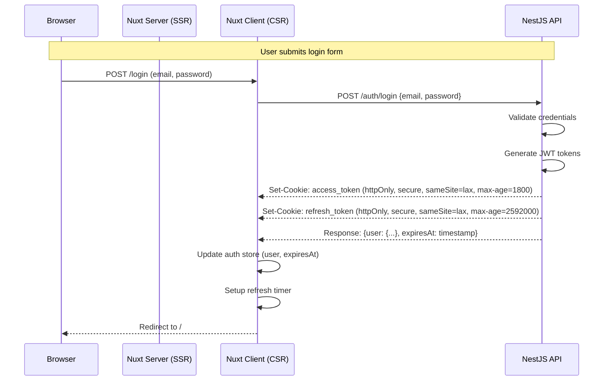
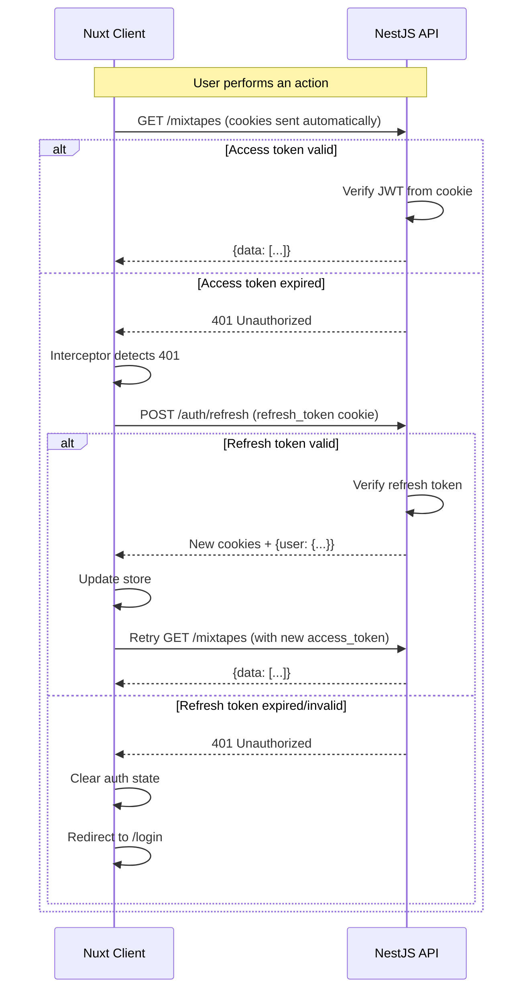
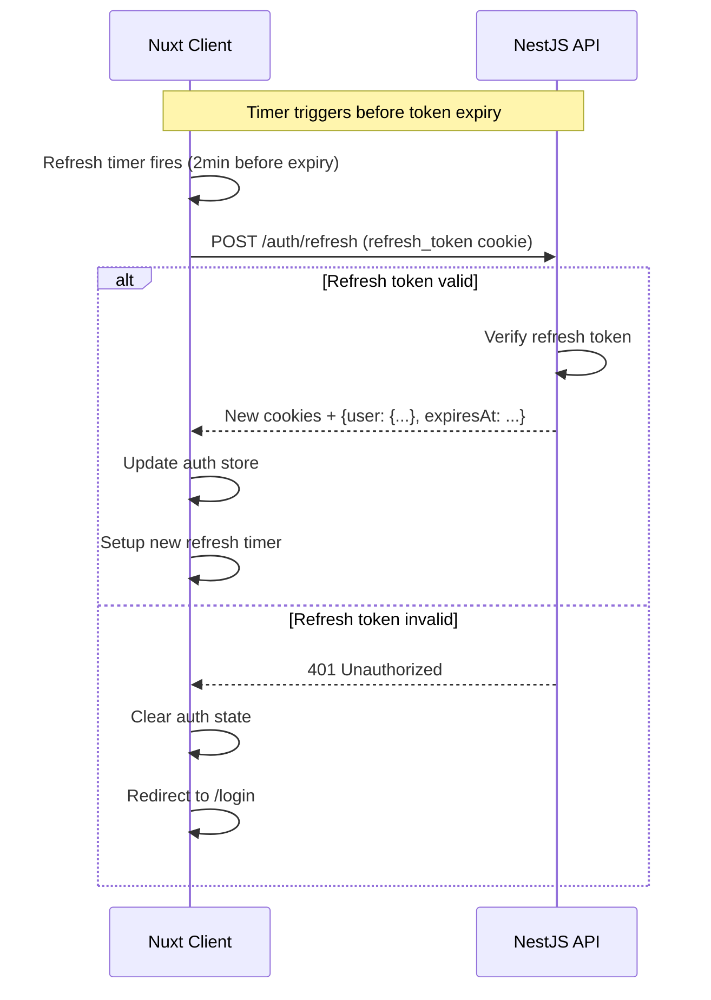
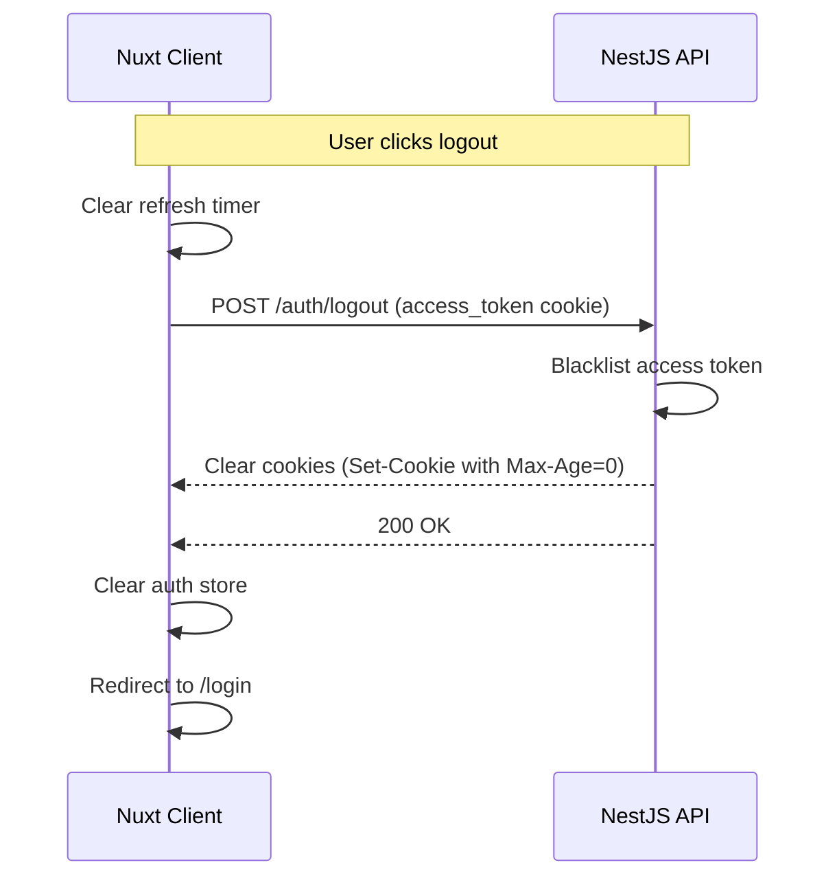
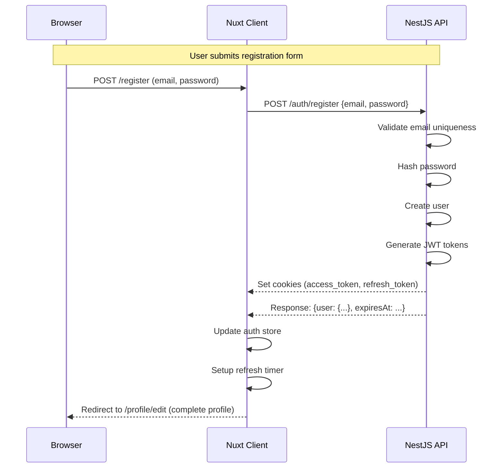
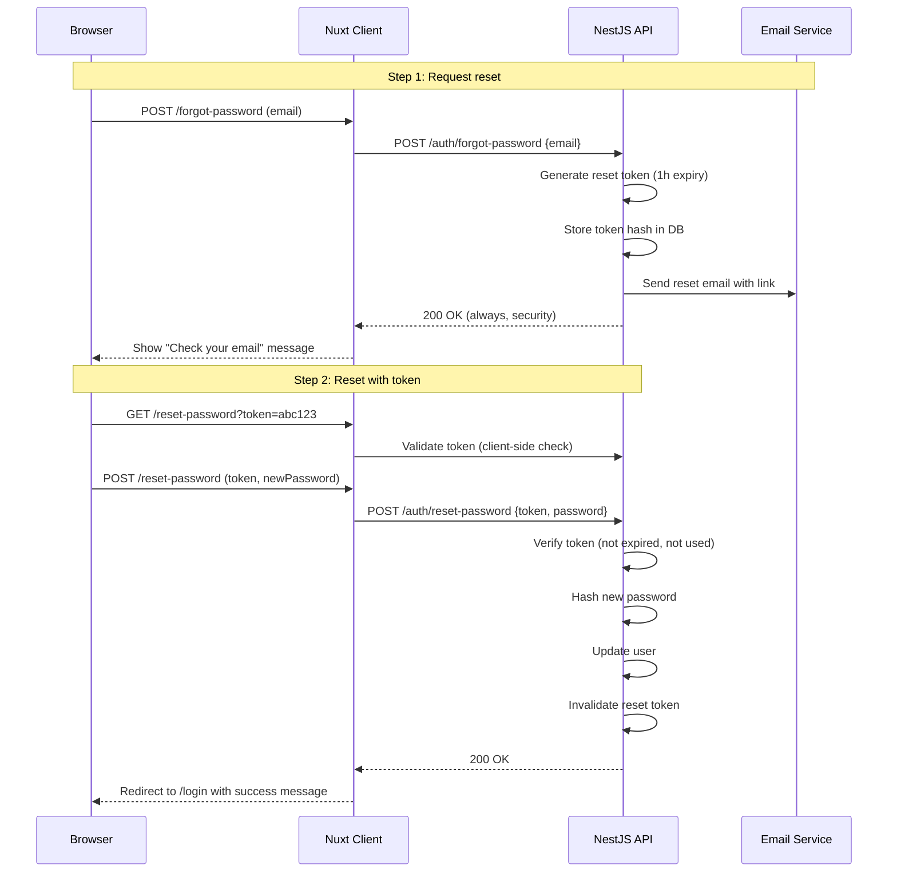

# Diagramme de Séquence - Authentification Idéale (Nuxt 4 SSR)

## Vue d'ensemble

Ce document décrit un système d'authentification idéal pour une application Nuxt 4 (SSR) avec une API NestJS, utilisant des **cookies httpOnly** pour une sécurité maximale.

## Principes de conception

### 🔐 Sécurité

- **Access token** : Stocké en cookie httpOnly (court terme, 15-30 min)
- **Refresh token** : Stocké en cookie httpOnly (long terme, 7-30 jours)
- **CSRF protection** : Tokens httpOnly non accessibles en JavaScript
- **Secure flag** : Transmission uniquement sur HTTPS en production

### 🚀 Performance

- **SSR hydration** : État auth préchargé depuis les cookies serveur
- **Cache intelligent** : TanStack Query avec cache SSR
- **Optimistic updates** : Pas de re-fetch inutile

### 🎯 UX

- **Refresh transparent** : Intercepteur automatique côté client
- **Pas de logout brutal** : Tentative de refresh avant de déconnecter
- **Redirections intelligentes** : Middleware SSR-aware

---

## 1️⃣ Login (Authentication initiale)



### Détails techniques

**Requête API Login:**

```http
POST /auth/login
Content-Type: application/json

{
  "email": "user@example.com",
  "password": "securePassword123"
}
```

**Réponse API:**

```http
HTTP/1.1 200 OK
Set-Cookie: access_token=eyJhbGc...; HttpOnly; Secure; SameSite=Lax; Path=/; Max-Age=1800
Set-Cookie: refresh_token=eyJhbGc...; HttpOnly; Secure; SameSite=Lax; Path=/auth/refresh; Max-Age=2592000
Content-Type: application/json

{
  "user": {
    "id": "uuid",
    "email": "user@example.com",
    "role": "USER",
    "profile": {
      "nickname": "John",
      ...
    }
  },
  "expiresAt": 1699999999999
}
```

**State côté Nuxt:**

```typescript
// Pinia store
{
  user: User | null,
  expiresAt: number | null,
  isAuthenticated: computed(() => !!user && Date.now() < expiresAt),
  refreshTimer: NodeJS.Timeout | null
}
```

---

## 2️⃣ Page Load avec SSR (Hydration)

```mermaid
sequenceDiagram
    participant Browser
    participant NuxtServer as Nuxt Server (SSR)
    participant API as NestJS API

    Note over Browser,API: User navigates to protected page

    Browser->>NuxtServer: GET /dashboard (with cookies)

    NuxtServer->>NuxtServer: Middleware: Check cookies

    alt Access token valid
        NuxtServer->>API: GET /auth/profile (with access_token cookie)
        API->>API: Verify JWT
        API-->>NuxtServer: {user: {...}}
        NuxtServer->>NuxtServer: Inject user in initial state
        NuxtServer-->>Browser: HTML with preloaded auth state

    else Access token expired but refresh token valid
        NuxtServer->>API: POST /auth/refresh (with refresh_token cookie)
        API->>API: Verify refresh token
        API-->>NuxtServer: New tokens + {user: {...}}
        NuxtServer->>NuxtServer: Set new cookies in response
        NuxtServer->>NuxtServer: Inject user in initial state
        NuxtServer-->>Browser: HTML + new cookies

    else No valid tokens
        NuxtServer-->>Browser: Redirect to /login
    end

    Browser->>Browser: Hydrate with SSR state
    Browser->>Browser: Setup client-side refresh timer
```



### Détails techniques

**Middleware SSR (`server/middleware/auth.ts`):**

```typescript
export default defineEventHandler(async (event) => {
  const accessToken = getCookie(event, 'access_token')
  const refreshToken = getCookie(event, 'refresh_token')

  if (!accessToken && !refreshToken) {
    return // Anonymous access
  }

  // Try to fetch user profile
  try {
    const user = await $fetch('/auth/profile', {
      baseURL: API_URL,
      headers: {
        Cookie: `access_token=${accessToken}`
      }
    })

    event.context.user = user
  } catch (error) {
    if (error.statusCode === 401 && refreshToken) {
      // Try refresh
      const result = await $fetch('/auth/refresh', {
        method: 'POST',
        baseURL: API_URL,
        headers: {
          Cookie: `refresh_token=${refreshToken}`
        }
      })

      // Set new cookies
      setCookie(event, 'access_token', result.access_token, { ... })
      setCookie(event, 'refresh_token', result.refresh_token, { ... })

      event.context.user = result.user
    }
  }
})
```

**Page avec SSR state:**

```vue
<script setup>
  // State is preloaded from server
  const { user } = useAuthStore()

  // No loading state needed, user is already available
</script>
```

---

## 3️⃣ API Call (Authenticated Request)



### Détails techniques

**Fetch interceptor (`composables/api.ts`):**

```typescript
export const useApi = () => {
  const authStore = useAuthStore()
  const router = useRouter()

  return $fetch.create({
    baseURL: API_URL,
    credentials: 'include', // Send cookies automatically

    async onResponseError({ response, options }) {
      if (response.status === 401) {
        // Try refresh
        try {
          await authStore.refresh()

          // Retry original request
          return $fetch(options.baseURL + options.url, options)
        } catch (refreshError) {
          // Refresh failed, logout
          await authStore.logout()
          await router.push('/login')
        }
      }
    },
  })
}
```

---

## 4️⃣ Token Refresh (Proactive)



### Détails techniques

**Setup du timer:**

```typescript
// stores/auth.ts
export const useAuthStore = defineStore('auth', () => {
  const setupRefreshTimer = () => {
    if (refreshTimer.value) {
      clearTimeout(refreshTimer.value)
    }

    if (!expiresAt.value) return

    // Refresh 2 minutes before expiry
    const refreshTime = expiresAt.value - Date.now() - 2 * 60 * 1000

    if (refreshTime > 0) {
      refreshTimer.value = setTimeout(async () => {
        await refresh()
      }, refreshTime)
    }
  }

  const refresh = async () => {
    const result = await $fetch('/auth/refresh', {
      method: 'POST',
      baseURL: API_URL,
      credentials: 'include',
    })

    user.value = result.user
    expiresAt.value = result.expiresAt
    setupRefreshTimer()
  }

  return { refresh, setupRefreshTimer }
})
```

---

## 5️⃣ Logout



### Détails techniques

**Logout function:**

```typescript
const logout = async () => {
  if (refreshTimer.value) {
    clearTimeout(refreshTimer.value)
  }

  try {
    await $fetch('/auth/logout', {
      method: 'POST',
      baseURL: API_URL,
      credentials: 'include',
    })
  } catch (error) {
    // Ignore errors, clear state anyway
  }

  user.value = null
  expiresAt.value = null

  await router.push('/login')
}
```

**API Response:**

```http
HTTP/1.1 200 OK
Set-Cookie: access_token=; HttpOnly; Secure; Path=/; Max-Age=0
Set-Cookie: refresh_token=; HttpOnly; Secure; Path=/; Max-Age=0
```

---

## 6️⃣ Register (New Account)



---

## 7️⃣ Password Reset Flow



---

## 🔧 Configuration API (Modifications nécessaires)

### Endpoints API à implémenter/modifier

#### 1. `/auth/login` - ✅ Existe, à modifier

```typescript
@Post('login')
async signIn(@Body() signInDto: SignInDto, @Res({ passthrough: true }) res: Response) {
  const result = await this.authService.signIn(signInDto.email, signInDto.password)

  // Set cookies
  res.cookie('access_token', result.access_token, {
    httpOnly: true,
    secure: process.env.NODE_ENV === 'production',
    sameSite: 'lax',
    maxAge: 30 * 60 * 1000, // 30 minutes
  })

  res.cookie('refresh_token', result.refresh_token, {
    httpOnly: true,
    secure: process.env.NODE_ENV === 'production',
    sameSite: 'lax',
    path: '/auth/refresh',
    maxAge: 7 * 24 * 60 * 60 * 1000, // 7 days
  })

  return {
    user: result.user,
    expiresAt: Date.now() + (30 * 60 * 1000)
  }
}
```

#### 2. `/auth/refresh` - ✅ Existe, à modifier

```typescript
@Post('refresh')
async refresh(@Req() req: Request, @Res({ passthrough: true }) res: Response) {
  const refreshToken = req.cookies['refresh_token']

  if (!refreshToken) {
    throw new UnauthorizedException('No refresh token')
  }

  const result = await this.authService.refreshTokens(refreshToken)

  // Set new cookies
  res.cookie('access_token', result.access_token, { ... })
  res.cookie('refresh_token', result.refresh_token, { ... })

  return {
    user: result.user,
    expiresAt: Date.now() + (30 * 60 * 1000)
  }
}
```

#### 3. `/auth/logout` - ✅ Existe, à modifier

```typescript
@Post('logout')
async logout(@Req() req: Request, @Res({ passthrough: true }) res: Response) {
  const accessToken = req.cookies['access_token']

  if (accessToken) {
    await this.authService.signOut(req.user.sub, accessToken)
  }

  // Clear cookies
  res.clearCookie('access_token')
  res.clearCookie('refresh_token', { path: '/auth/refresh' })

  return { message: 'Logged out' }
}
```

#### 4. Guard JWT Strategy - Modifier pour lire depuis cookies

```typescript
@Injectable()
export class JwtStrategy extends PassportStrategy(Strategy) {
  constructor(private configService: ConfigService) {
    super({
      jwtFromRequest: ExtractJwt.fromExtractors([
        (request: Request) => {
          // Try cookie first, fallback to Authorization header
          return request?.cookies?.access_token || ExtractJwt.fromAuthHeaderAsBearerToken()(request)
        },
      ]),
      secretOrKey: configService.get('JWT_SECRET'),
    })
  }
}
```

---

## 🎯 Configuration Nuxt (Modifications nécessaires)

### 1. Fetch wrapper avec cookies

```typescript
// composables/api.ts
export const useApi = () => {
  return $fetch.create({
    baseURL: useRuntimeConfig().public.apiUrl,
    credentials: 'include', // CRUCIAL: Send cookies

    async onResponseError({ response, options }) {
      if (response.status === 401) {
        const authStore = useAuthStore()
        try {
          await authStore.refresh()
          // Retry
          return $fetch(options.url, options)
        } catch {
          await authStore.logout()
        }
      }
    },
  })
}
```

### 2. Server middleware

```typescript
// server/middleware/auth.ts
export default defineEventHandler(async (event) => {
  const config = useRuntimeConfig()
  const accessToken = getCookie(event, 'access_token')

  if (accessToken) {
    try {
      const user = await $fetch('/auth/profile', {
        baseURL: config.public.apiUrl,
        headers: { Cookie: `access_token=${accessToken}` },
      })
      event.context.user = user
    } catch {
      // Token invalid, will try refresh in route middleware
    }
  }
})
```

### 3. Route middleware

```typescript
// middleware/auth.global.ts
export default defineNuxtRouteMiddleware(async (to) => {
  const authStore = useAuthStore()

  if (import.meta.server) {
    // SSR: Use injected user from server middleware
    const event = useRequestEvent()
    if (event?.context.user) {
      authStore.setUser(event.context.user)
    }
  }

  // Protected routes
  if (to.meta.requiresAuth && !authStore.isAuthenticated) {
    return navigateTo('/login')
  }
})
```

---

## 📊 Comparaison: Actuel vs Idéal

| Aspect               | Actuel (Problématique)   | Idéal (Proposé)                        |
| -------------------- | ------------------------ | -------------------------------------- |
| **Stockage tokens**  | localStorage + cookies?  | httpOnly cookies uniquement            |
| **SSR hydration**    | Re-fetch côté client     | State préchargé depuis cookies serveur |
| **Refresh strategy** | Réactif (après 401)      | Proactif (timer) + Réactif (fallback)  |
| **CSRF protection**  | ❌ Tokens accessibles JS | ✅ httpOnly = pas de XSS               |
| **Complexité**       | Usine à gaz              | Simple et standard                     |
| **Performance SSR**  | Mauvaise (waterfall)     | Excellente (1 requête)                 |

---

## ❓ Questions à discuter

### 1. ✅ Durée des tokens

**Décision** : 30min access / 7 jours refresh
**Configuration** : Paramétrable via env vars

```env
# API (.env)
JWT_ACCESS_TOKEN_EXPIRY=30m
JWT_REFRESH_TOKEN_EXPIRY=7d

# Nuxt (.env)
NUXT_PUBLIC_ACCESS_TOKEN_EXPIRY=1800000  # 30min en ms
```

---

### 2. ⚠️ Path du refresh token cookie

**Question** : Faut-il restreindre le cookie refresh_token à un path spécifique ?

#### Option A : Path global `/` (recommandé)

```typescript
res.cookie('refresh_token', token, {
  path: '/', // Envoyé sur toutes les requêtes
  httpOnly: true,
  // ...
})
```

**Avantages** :

- ✅ Plus simple à gérer
- ✅ Fonctionne avec n'importe quel endpoint de refresh
- ✅ Pas de problème si on change l'URL du refresh

**Inconvénients** :

- ⚠️ Cookie envoyé sur TOUTES les requêtes (quelques bytes de plus)
- ⚠️ Légèrement moins sécurisé (mais marginal)

#### Option B : Path restreint `/auth/refresh`

```typescript
res.cookie('refresh_token', token, {
  path: '/auth/refresh', // Envoyé UNIQUEMENT sur ce endpoint
  httpOnly: true,
  // ...
})
```

**Avantages** :

- ✅ Cookie envoyé uniquement quand nécessaire
- ✅ Légèrement plus sécurisé (principe du moindre privilège)

**Inconvénients** :

- ❌ Plus complexe à gérer
- ❌ Doit matcher exactement le path du endpoint
- ❌ Problème si on veut changer l'URL plus tard

**Ma recommandation** : **Option A (path global)** pour la simplicité. La différence de sécurité est négligeable car le token est déjà httpOnly.

---

### 3. ✅ SameSite

**Décision** : `lax`

---

### 4. ✅ Refresh strategy

**Décision** : **Proactif (timer) + Réactif (fallback 401)**

Pour une UX fluide et transparente :

- ✅ Timer refresh 2 minutes avant expiration (proactif)
- ✅ Intercepteur 401 qui tente un refresh (réactif, sécurité)
- ✅ Pas de déconnexion brutale
- ✅ Transparent pour l'utilisateur

---

### 5. ⚠️ Cookie domain

**Question** : Faut-il définir le domaine du cookie pour gérer des sous-domaines ?

#### Contexte

Imaginons que ton app tourne sur :

- **Production** : `https://nina.fm` (frontend) + `https://api.nina.fm` (backend)
- **Ou** : `https://www.nina.fm` (frontend) + `https://api.nina.fm` (backend)
- **Ou** : `https://app.nina.fm` (frontend) + `https://api.nina.fm` (backend)

#### Option A : Pas de domain (défaut) - Same origin only

```typescript
res.cookie('access_token', token, {
  // Pas de domain défini
  httpOnly: true,
})
```

**Comportement** :

- Cookie valide UNIQUEMENT pour le domaine exact qui l'a défini
- Si API sur `api.nina.fm`, cookie uniquement pour `api.nina.fm`
- ✅ Fonctionne si frontend et backend sur même domaine

**Problème** :

- ❌ Ne fonctionne PAS si frontend sur `nina.fm` et API sur `api.nina.fm`

#### Option B : Domain explicite avec point

```typescript
res.cookie('access_token', token, {
  domain: '.nina.fm', // Valide pour nina.fm ET tous sous-domaines
  httpOnly: true,
})
```

**Comportement** :

- Cookie valide pour `nina.fm`, `api.nina.fm`, `www.nina.fm`, etc.
- ✅ Fonctionne pour frontend et API sur sous-domaines différents

**Configuration recommandée** :

```typescript
// API - auth.controller.ts
const cookieOptions = {
  httpOnly: true,
  secure: process.env.NODE_ENV === 'production',
  sameSite: 'lax',
  domain: process.env.COOKIE_DOMAIN || undefined, // undefined = default
}
```

```env
# Production
COOKIE_DOMAIN=.nina.fm

# Local dev
# COOKIE_DOMAIN non défini = localhost
```

**Ma question** :

- Est-ce que ton **frontend** et ton **API** seront sur le **même domaine** (ex: `nina.fm/api`) ?
- Ou sur des **sous-domaines différents** (ex: `app.nina.fm` + `api.nina.fm`) ?

---

### 6. ⚠️ Développement local & CORS

**Problématique** : En développement local, tu as probablement :

- **Frontend Nuxt** : `http://localhost:3001`
- **API NestJS** : `http://localhost:3000`

#### Problème 1 : Cookies cross-origin

Les cookies ne fonctionnent pas entre `localhost:3001` → `localhost:3000` par défaut (même en local).

#### Solution A : Utiliser le même domaine local (recommandé)

Configurer `/etc/hosts` :

```bash
# /etc/hosts
127.0.0.1 local.nina.fm
```

Puis :

- Frontend : `http://local.nina.fm:3001`
- API : `http://local.nina.fm:3000`

**Avantages** :

- ✅ Cookies fonctionnent
- ✅ Plus proche de la prod
- ✅ Pas de CORS complexe

#### Solution B : CORS avec credentials (plus complexe)

```typescript
// API - main.ts
app.enableCors({
  origin: 'http://localhost:3001', // Frontend exact
  credentials: true, // CRUCIAL pour cookies
  allowedHeaders: ['Content-Type', 'Authorization'],
})
```

```typescript
// Nuxt - nuxt.config.ts
export default defineNuxtConfig({
  runtimeConfig: {
    public: {
      apiUrl: 'http://localhost:3000',
    },
  },
})
```

**Problème** : Secure flag ne fonctionne pas en HTTP

**Solution** : Désactiver secure en dev

```typescript
const cookieOptions = {
  httpOnly: true,
  secure: process.env.NODE_ENV === 'production', // false en dev
  sameSite: 'lax',
}
```

#### Ma recommandation pour le dev local

**Option 1 : Proxy Nuxt (le plus simple)**

```typescript
// nuxt.config.ts
export default defineNuxtConfig({
  nitro: {
    devProxy: {
      '/api': {
        target: 'http://localhost:3000',
        changeOrigin: true,
      },
    },
  },
})
```

Avec ça :

- Frontend : `http://localhost:3001`
- API calls : `http://localhost:3001/api/*` → proxied vers `http://localhost:3000`
- ✅ Même origine = cookies fonctionnent
- ✅ Pas de CORS
- ✅ Simple

**Option 2 : Domaine local custom**

- Éditer `/etc/hosts`
- Frontend : `http://dev.nina.fm:3001`
- API : `http://dev.nina.fm:3000`
- Configurer CORS avec credentials

**Ma question** :

- Quelle approche préfères-tu pour le dev local ?
- Proxy Nuxt (plus simple) ou domaine custom (plus proche prod) ?

---

## 📝 Résumé des décisions finales

| Question            | Décision              | Config                                                           |
| ------------------- | --------------------- | ---------------------------------------------------------------- |
| 1. Durée tokens     | ✅ 30min / 7j         | Env vars (`JWT_ACCESS_TOKEN_EXPIRY`, `JWT_REFRESH_TOKEN_EXPIRY`) |
| 2. Path refresh     | ✅ Global `/`         | Simplicité, marginal en sécurité                                 |
| 3. SameSite         | ✅ `lax`              | Fixe                                                             |
| 4. Refresh strategy | ✅ Proactif + Réactif | Timer 2min avant expiry + intercepteur 401                       |
| 5. Cookie domain    | ✅ `.nina.fm`         | Production: `api.nina.fm` + `faceb.nina.fm`                      |
| 6. Dev local        | ✅ Proxy Nuxt         | `/api/*` proxied vers `localhost:3000`                           |

---

## 🏗️ Architecture de déploiement

### Production (Digital Ocean - Docker)

```
┌─────────────────────────────────────────┐
│         nginx (reverse proxy)           │
│                                         │
│  faceb.nina.fm → Frontend Container    │
│  api.nina.fm   → API Container         │
└─────────────────────────────────────────┘

Cookies domain: .nina.fm
- Partagés entre api.nina.fm et faceb.nina.fm
- httpOnly, secure, sameSite=lax
```

### Développement local

```
┌─────────────────────────────────────────┐
│      localhost:3001 (Nuxt Dev)          │
│                                         │
│  /           → Frontend                 │
│  /api/*      → Proxy → localhost:3000  │
└─────────────────────────────────────────┘

Cookies domain: localhost (default)
- httpOnly, secure=false, sameSite=lax
```

---

## 🚀 Avantages de cette approche

### Sécurité

- ✅ Tokens inaccessibles au JavaScript (XSS protection)
- ✅ httpOnly + Secure flags
- ✅ SameSite protection contre CSRF
- ✅ Short-lived access tokens

### Performance

- ✅ Pas de flash de "loading" au SSR
- ✅ État auth disponible immédiatement
- ✅ Moins de requêtes API (refresh proactif)

### DX (Developer Experience)

- ✅ Pattern standard et bien documenté
- ✅ Moins de code custom
- ✅ Debugging plus facile

### UX (User Experience)

- ✅ Navigation fluide (pas de re-login surprise)
- ✅ Pas de logout brutal sur token expiry
- ✅ Refresh transparent

---

**Note** : Ce diagramme représente un système **idéal et théorique**. Les adaptations pour l'implémentation réelle dépendront de vos retours et contraintes spécifiques.
